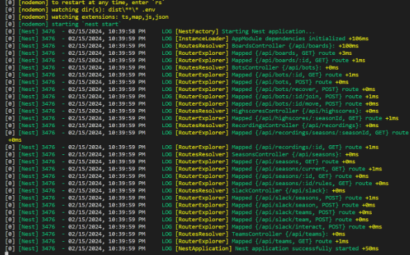

<h1 align="center"> Tugas Besar 1 IF2211 Strategi Algoritma</h1>
<h1 align="center">  Algoritma Greedy dalam Pembuatan Bot Permainan Diamonds </h1>

## Identitas Pengembang Program

### **Kelompok 40: KOIN/ONDO**

|   NIM    |        Nama        |
| :------: | :----------------: |
| 13522073 |   Juan Alfred W    |
| 13522077 |   Enrique Yanuar   |
| 13522117 | Mesach Harmasendro |

## Deskripsi Program

Diamonds adalah tantangan pemrograman yang bertujuan untuk bertanding menggunakan bot yang Anda kembangkan melawan bot dari pemain lain. Setiap peserta akan memilik sebuah bot dengan tujuan utama untuk mengumpulkan sebanyak mungkin diamond. Namun, proses pengumpulan diamond ini tidak akan mudah karena terdapat berbagai tantangan seperti serangan dari bot lawan dan kebutuhan untuk menemukan strategi paling efisien dalam meraih kemenangan, menambahkan tingkat keseruan dan kompleksitas pada permainan. Untuk keluar sebagai pemenang, pemain harus merancang dan menerapkan strategi khusus pada bot mereka.

Repositori ini berisi implementasi algoritma **_greedy by highest block reward per distance from bot_** dalam pembuatan bot permainan diamonds. **_Greedy by highest block reward per distance from bot_** adalah algoritma yangb menghitung nilai reward dari diamond utama dan semua diamond di sekitarnya dalam radius 1 (3x3 blok), kemudian dibagi dengan jarak antara diamond utama dan bot. Semakin dekat diamond utama ke bot, semakin tinggi nilainya. Algoritma ini tidak mempertimbangkan jarak antara diamond utama ke base dan tidak menghitung jarak melalui teleporter. Teleporter hanya dipertimbangkan setelah tujuan bot telah ditentukan.

## Requirements Program

1. **Game Engine**

   Requirement yang harus di-install:

   - Node.js (https://nodejs.org/en)
   - Docker desktop (https://www.docker.com/products/docker-desktop/)
   - Yarn

     ```bash
     npm install --global yarn
     ```

2. **Bot Starter Pack**

   Requirement yang harus di-install

   - Python (https://www.python.org/downloads/)

## Set Up dan Build Repositopry KOIN-ONDO

1. Jalankan game engine dengan cara melakukan clone pada repository ini kemuadian unduh starter pack game engine dalam bentuk file .zip yang terdapat pada tautan berikut https://github.com/haziqam/tubes1-IF2211-game-engine/releases/tag/v1.1.0.

   a. a. Setelah melakukan instalasi, lakukan ekstraksi file .zip tersebut lalu masuk ke root folder dari hasil ekstraksi file tersebut kemudian jalankan termina

   b. Jalankan perintah berikut pada terminal untuk masuk ke root directory dari game engine

   ```bash
   cd tubes1-IF2110-game-engine-1.1.0
   ```

   c. Lakukan instalasi dependencies menggunakan yarn.

   ```bash
   yarn
   ```

   d. Lakukan setup environment variable dengan menjalankan script berikut untuk OS Windows

   ```bash
   ./scripts/copy-env.bat
   ```

   Untuk Linux / (possibly) macOS

   ```bash
   chmod +x ./scripts/copy-env.sh
   ./scripts/copy-env.sh
   ```

   e. Lakukan setup local database dengan membuka aplikasi docker desktop terlebih dahulu kemudian jalankan perintah berikut di terminal

   ```bash
   docker compose up -d database
   ```

   f. Kemudian jalankan script berikut. Untuk Windows

   ```bash
   ./scripts/setup-db-prisma.bat
   ```

   Untuk Linux / (possibly) macOS

   ```bash
   chmod +x ./scripts/setup-db-prisma.sh
   ./scripts/setup-db-prisma.sh
   ```

   g. Jalankan perintah berikut untuk melakukan build frontend dari game-engine

   ```bash
   npm run build
   ```

   h. Jalankan perintah berikut untuk memulai game-engine

   ```bash
   npm run start
   ```

   i. Jika berhasil, tampilan terminal akan terlihat seperti gambar di bawah ini.
   

2. Jalankan bot starter pack

   a. kembali ke directory "src"
   b. Jalankan perintah berikut untuk masuk ke root directory dari project

   ```bash
   cd tubes1-IF2110-bot-starter-pack-1.0.1
   ```

   c. Jalankan perintah berikut untuk menginstall dependencies dengan menggunakan pip

   ```bash
   pip install -r requirements.txt
   ```

   d. Jalankan program dengan cara menjalankan perintah berikuts.

   ```bash
   python main.py --logic bpdbot --email=your_email@example.com --name=your_name --password=your_password --team etimo
   ```

   e. Anda juga bisa menjalankan satu bot saja atau beberapa bot menggunakan .bat atau .sh script.
   Untuk windows

   ```
   ./run-bots.bat
   ```

   Untuk Linux / (possibly) macOS

   ```
   ./run-bots.sh
   ```
